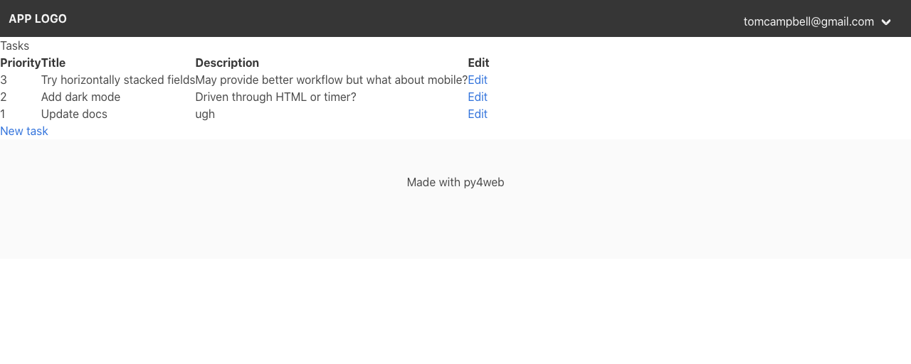
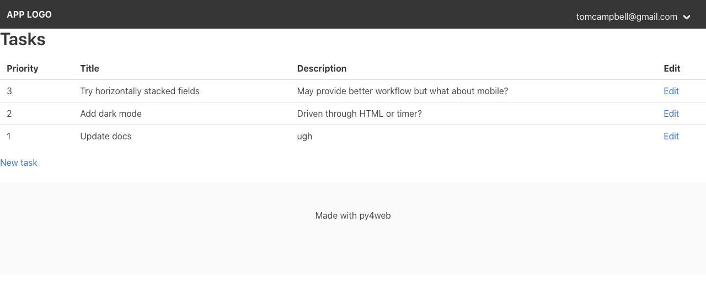

# Bulma.css

[Bulma](https://bulma.io/) is a CSS framework used by default in py4web. 
You aren't restricted to Bulma but since it's built in you might want
a brief review of how you can use it with py4web.

## Quick references

* [Hero](https://bulma.io/documentation/layout/hero/)
* [Section](https://bulma.io/documentation/layout/section/)
* [Typography](https://bulma.io/documentation/helpers/typography-helpers/)
* [Color](https://bulma.io/documentation/helpers/color-helpers/)
* [Spacing](https://bulma.io/documentation/helpers/spacing-helpers/)
* [Visibility](https://bulma.io/documentation/helpers/visibility-helpers/): showing and hiding content
* [Other](https://bulma.io/documentation/helpers/other-helpers/): 
* GitHub source [CSS source](https://github.com/jgthms/bulma/blob/master/css/bulma.css), [home page](https://github.com/jgthms/bulma)

## Things py4web already did for you

The Bulma documentation describes a [starter template](https://bulma.io/documentation/overview/start/) but you can disregad that because the default [layout.html](layout-html.md) already includes what's necessary, such as the stylesheet itself, the [viewport metatag](https://developer.mozilla.org/en-US/docs/Mozilla/Mobile/Viewport_meta_tag), and other boilerplate, so you can just dive right in and use Bulma's features.

## Bulma starts out by "unformatting" CSS elements

Bulma is a set of CSS classes that at first appears to do exactly
the wrong thing when you include `bulma.css`: it removes most formatting from
HTML elements. You then apply classes to the HTML elements, even when it seems unnecessary. For example, as shown below, a `<table>` element doesn't look that tabular until you apply the Bulma `table` class to it.

## Example: view using Bulma defaults

Here's the source code for a table generated from data, using Bulma (which has already been included via [layout.html](layout-html.md):

```html
[[extend 'layout.html']]
<h1>Tasks</h1>
<table> <tr><th>Priority</th><th>Title</th><th >Description</th><th>Edit</th></tr>
  [[for q in query:]]
    <tr><td>[[=q.priority]]</td><td>[[=q.title]]</td><td>[[=q.description]]</td><td>[[=A('Edit', _href=URL('edit', q.id))]]</td></tr>
  [[pass]]
</table>
[[=A('New task', _href=URL('new'))]]    
</div>
```
Here's what that table looks like with some sample data, using Bulma's default styling:



## Shortcut: use the content class

The quickest way to restore formatting to an HTML document that uses Bulma is to wrap your page's client area in a `div` using Bulma's [content class](https://bulma.io/documentation/overview/classes/), which applies a smart set of defaults to the HTML that works well for prototyping:


```html
[[extend 'layout.html']]
<div class="content">
    <h1>Tasks</h1>
    <table>
        <tr><th>Priority</th><th>Title</th><th >Description</th><th>Edit</th></tr>
    [[for q in query:]]
        <tr><td>[[=q.priority]]</td><td>[[=q.title]]</td><td>[[=q.description]]</td><td>[[=A('Edit', _href=URL('edit', q.id))]]</td></tr>
    [[pass]]
    </table>
    [[=A('New task', _href=URL('new'))]]    
</div>
```

Already, the formatting looks much more sensible:




