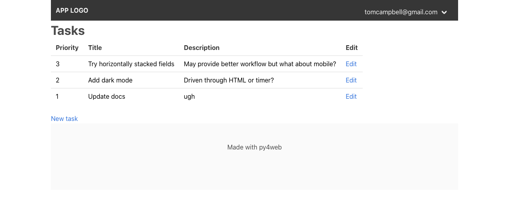

# py4web tutorial: create a todo list web app in 75 lines of code

## TODO: 
* The whole thing has just been started 7/5/2020 so obviously most of it is missing, but the code for it can be found at this [gist](https://gist.github.com/tomcam/7b723cbb5f6542f54532d45c1dbc2d19).
* There will be lots of screenshots, but things change so I usually wait near the end for those
* It will serve as the script for a video
* In a separate lesson I will probably bite the bullet and include instructions on
  - Installing Python
  - Installing pip
  - Installing web2py from source
* Very soon there will be a number of mini-lessons to do things like create a view, create a controller, and create a model. They'll be little refreshers to people who aren't too used to the py4web way of doing things. They'll show how to do it on Windows, Mac, and maybe Linux.

* Feel free to file [issues](https://github.com/tomcam/py4webcasts/issues) on anything, especially anything you think should be in the [glossary](https://github.com/tomcam/py4webcasts/blob/master/glossary.md)
* Don't worry about being mean. My goal is to get as many people as possible to use py4web.
* Questions
  - Should I do a super introductory one that shows a rudimentary controller and view, a "hello world" kind of thing?
  - I tend to think of all projects as starting with the data model, not the controller. Any compelling reason to think otherwise?
  - I believe the biggest win with py4web is in creating secure, fast, database-backed sites with the least code of any web framework ever, so I think the course should focus on that side of things. Thoughts?

This lesson contains every line of code you need to type to create a working database-backed website used to track issues. Because it's meant to get you started it's not a full-feature app, but it follows industry best practices and takes no shortcuts. 

## About py4web

[py4web](https://py4web.com) is the result of 15 years of work led by [Massimo Di Pierro](https://www.cdm.depaul.edu/Faculty-and-Staff/Pages/faculty-info.aspx?fid=343), a sickeningly accomplished Physics PhD, full professor, and actual rocket scientist. Its predecessor is the still very much alive [web2py](https://web2py.com). py4web is the logical successor to web2py, with higher performance and fewer bells and whistles, along with full Python 3 compatibility. 

## About you 

This lesson assumes you know:

* The very basics of publishing a website using HTML and CSS
* A little about Python: conditionals, loops, dictionaries, and classes
* A little about your system's terminal: how to log in, how to start the terminal program, and how to use a text editor
* What Git is and a little about how to use it

### About your programming environment

This lesson assumes your system contains:
* A stable version of [Python version 3](https://www.python.org/downloads/)
* The [Pip](https://pip.pypa.io/en/stable/installing/) package manager
* [Git](https://git-scm.com)
* A text editor. Vim is used here but anywhere you see a command line with vim on it just replace it with Visual Studio, Notepad++, or whatever text editor you prefer
* And of course, [py4web](https://py4web.com)

## What you'll create in this lesson



## Create the database model

py4web uses a database access abstraction layer (DAL) package called [PyDal](glossary.md#pydal). It's a portable, ridiculously comprehensive, yet lightweight means of using databases from SQLite to MongoDB to PostgreSQL and many more. SQLite is included with web2py so you can publish a database-backed web app with zero configuration at all.

What makes PyDal more compelling than other DALs is that it is packed with features that control how data is validated going in through forms, or going in through database import, or how it is displayed. PyDal supports many, many different databases but lets you do virtually everything you need in Pythoh. You may never have to drop into SQL at all.


### Add the following lines to `models.py`:

```python
from datetime import datetime

db.define_table('task',
    Field('title',unique=True,notnull=True),
    Field('description','text'),
    Field('priority','integer',default=3,requires=IS_IN_SET([1,2,3,4,5]),zero=True),
    Field('created_on', 'datetime', default=datetime.now),
    Field('created_by','reference auth_user',default=Auth.get_user))

db.commit()
```


